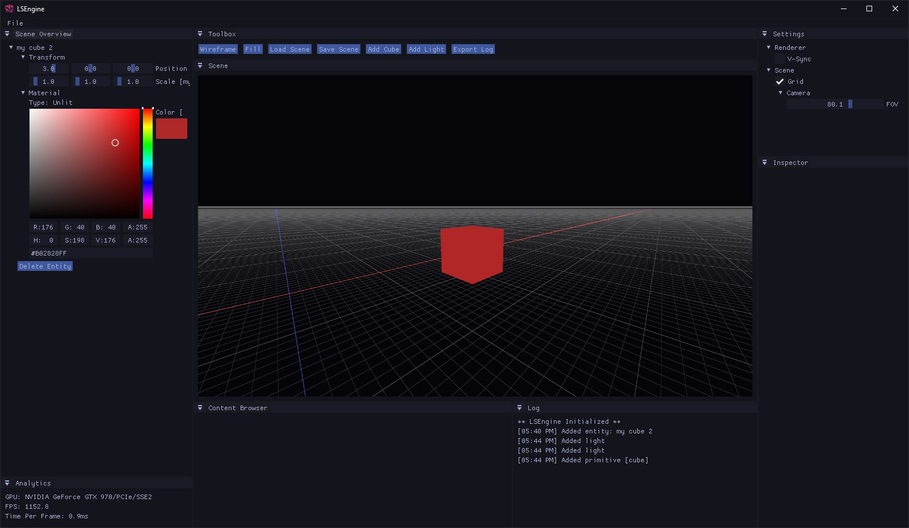

<h1 align="center">
LSEngine - OpenGL Game Engine
</h1>

## Goals
The intention of this project is first and foremost as a learning tool. I am by no means an expert in computer graphics programming but it's always piqued my interest. The main goal is to create at it's most basic, a fully featured game engine. The renderer and level editor are being developed simultaneously but this will eventually be split in to a less monolithic code-base down the road. 

**Classes**:
- [LSEngine](LSEngine/LSEngine.h) - Basic engine functions and configuration. Responsible for creating & managing windows, processing input, drawing graphics, and cleaning up.
- [LSShader](LSEngine/LSShader.h) - Manages GLSL shaders. Reads/compiles from files and loads/links shaders.
- [LSCamera](LSEngine/LSCamera.h) - Create and manage camera/s in the scene. Handles movement, input, and matrix mathematics for perspective projection.
- [LSUtilities](LSEngine/LSUtilities.h) - Helper functions
- [LSSceneManager](LSEngine/LSSceneManager.h) - Manages the saving/loading of scenes in to the editor
- [LSMaterial](LSEngine/LSMaterial.h) - Links shaders with textures and some other properties like object color, shininess, diffuse, etc. Will eventually switch over to PBR but the Phong model is much simpler to work with in the early stages of development.
- [LSEntity](LSEngine/LSEntity.h) - An object in the scene with geometry, material, and transform properties. Analogous to Actors in Unreal or GameObjects in Unity.
- [LSPrimative](LSEngine/LSPrimative.h) - Primative meshes such as cubes and planes. Basically just hard-coded normalized vertex data stored in arrays.

**Resources**:
- [resources/shaders](LSEngine/resources/shaders) - Shader source files for all the built in shaders
- [resources/textures](LSEngine/resources/textures) - Default texture files that can be used in the editor
- [resources/meshes](LSEngine/resources/meshes) - Meshes used for the editor
- [resources/scenes](LSEngine/resources/scenes) - Scene files

## TODO:

- [ ] Load Models (.obj, .fbx)
- [x] Materials (linking shaders with textures)
- [ ] Material Shaders
- [x] Primitives (ability to create cubes/spheres/etc)
- [ ] UI
- [ ] Post Processing Shaders (bloom, vignette, tonemapping, etc)
- [ ] Lights (directional, point, area, etc)
- [x] 'Entities' or objects in scene that contain a mesh, material, and transform properties
- [ ] Shadows
- [ ] Level Editor
- [ ] SceneGraph for creating/saving/loading levels
- [ ] Scriptability

## Changelog

To see what changes have been made to the project's version history, you can check the [Changelog](CHANGELOG.md) document.

## Resources

Here's a collection of online resources I've found useful while working on this project:

- [LearnOpenGL.com](https://learnopengl.com) - A-Z style guide on working with modern OpenGL. Plenty of really good examples and explainations for everything from basic API calls to advanced lighting like raytracing and PBR. Invaluable resource for anyone starting out with graphics programming.
- [How to make an infinite grid.](http://asliceofrendering.com/scene%20helper/2020/01/05/InfiniteGrid/) - This article by [Marie Eve Dube](https://github.com/bugztroll) has a great walkthrough on creating an infinite reference grid with shaders.
- [ShaderToy](https://shadertoy.com) - ShaderToy is a huge collection of really cool scenes people have built with shaders. Great site to reference if you're looking for how to do something in a shader.
- [asc-community/MxEngine](https://github.com/asc-community/MxEngine) - MxEngine is an open source game engine built with OpenGL and C++.
- [TheCherno/Hazel](https://github.com/TheCherno/Hazel) Another open source game engine written in C++. Uses Vulkan instead of OpenGL but is a great reference for UI design with ImGui and TheCherno's YouTube channel has tons of in-depth explainations on game engine design concepts.
